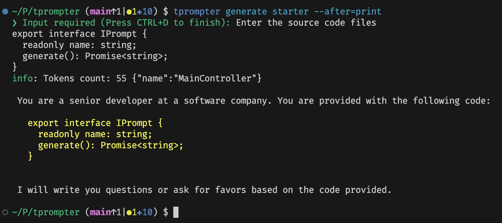

# ❯ tprompter

```bash
$ ask anything
```

`tprompter` is a developer-friendly, CLI-first tool that streamlines interactions with AI language models.

It comes with built-in agents and templates to help you solve your tasks using large language models (LLMs).

The tool automatically generates prompts, embeds local file content (for code reviews, test generation, etc.), and archives each request for future reference. Its “Actions” feature allows you to copy or print results, open them in your text editor, or feed them directly into ChatGPT—all while providing easy configuration (e.g., setting your OpenAI API key) via a simple CLI interface.

> Work in Progress

- [❯ tprompter](#-tprompter)
  - [Core Features](#core-features)
  - [Usage Examples](#usage-examples)
    - [Ask a Question in Terminal](#ask-a-question-in-terminal)
    - [Run an Agent](#run-an-agent)
    - [Run a Chain of Agents](#run-a-chain-of-agents)
    - [Embedding](#embedding)
    - [Prompts generator](#prompts-generator)
    - [Configuration](#configuration)
  - [Build and Installation](#build-and-installation)
    - [Install from the npm Registry](#install-from-the-npm-registry)
    - [Install from Source Code](#install-from-source-code)
  - [Out-of-the-Box Available Templates and Agents](#out-of-the-box-available-templates-and-agents)
  - [Usage](#usage)
    - [Help](#help)
    - [List Available Agent/Prompt Templates](#list-available-agentprompt-templates)
    - [Generate a Prompt by Template Name](#generate-a-prompt-by-template-name)
    - [Generate a Prompt from a File](#generate-a-prompt-from-a-file)
    - [Retrieve the Last Prompt from Archive](#retrieve-the-last-prompt-from-archive)
    - [Install a Custom Template (from File)](#install-a-custom-template-from-file)
    - [Uninstall a Custom Template](#uninstall-a-custom-template)
    - [Open the Templates Folder](#open-the-templates-folder)
  - [File Embedding](#file-embedding)
  - [FAQ](#faq)
    - [What Actions Are Available?](#what-actions-are-available)
    - [How Does "Open in ChatGPT" Work?](#how-does-open-in-chatgpt-work)
      - [How to Install the Injection Script](#how-to-install-the-injection-script)
    - [How to Install Shell Completion (bash/zsh)](#how-to-install-shell-completion-bashzsh)
    - [How to Install Shell Completion (fish)](#how-to-install-shell-completion-fish)
    - [How to contribute?](#how-to-contribute)

## Core Features

- Built-in and custom agents and chains of agents
- Direct interaction with LLMs
- Automatic embedding of file content into prompts
- Prompt generation based on templates and your source code
- Built-in archive for accessing previous prompts and requests
- Automatic forwarding of prompts to the ChatGPT web page for users without an API key
- Full shell completion support for ease of use:
  - [x] bash
  - [x] zsh
  - [x] fish
- Supported LLMs:
  - [x] ChatGPT
  - [ ] Claude
  - [ ] DeepSeek
- Support for shell pipes (e.g., `git diff | tprompter generate commit_message --after=chatgpt`)

## Usage Examples

### Ask a Question in Terminal

```bash
tprompter ask --model o3-mini "What's on your mind?"
tprompter ask --after=print_raw "I need plain output"
```


The model is aware of the OS and shell version


### Run an Agent

tprompter includes built-in agents to assist you with various tasks. For example, the `code_review` agent generates a code review prompt.

```bash
tprompter agent code_review
```


Shell pipes are supported, allowing you to pass the output of any command directly to an agent.

### Run a Chain of Agents

tprompter supports chaining agents to refine LLM output. For example:

```bash
$ cat /path/to/file.ts | tprompter agent unit_test | tprompter agent code_review
$ tprompter archive 1 --after=print_raw # to see the unit_tests' original answer
```


### Embedding

File embedding is supported: simply drag and drop a file from your IDE, Finder, or Explorer into the terminal. Folder embedding is also supported.


See the [File Embedding](#file-embedding) section for more details.

### Prompts generator

If you need to quickly generate a prompt based on a template, use the generate command. You can then copy the prompt to your clipboard and paste it into the ChatGPT page (or any other LLM interface).



You can directly pass the prompt to the ChatGPT web-page by using the `--after=chatgpt` option. See the [How "Open in ChatGPT" works?](#how-open-in-chatgpt-works) section for more details.

This feature is particularly useful when working with large codebases on high-cost models such as o1. It saves time and resources while providing a full ChatGPT experience.

For example, to generate a starter prompt:

```bash
tprompter generate starter --after=chatgpt
```

Then, use ChatGPT to assist with code reviews, unit tests, or other tasks.

### Configuration

There is no specific configuration file; you can set the configuration via the CLI:

```bash
tprompter config openAIApiKey <your_api_key>
```

The `tprompter` will suggest you set the `openAIApiKey` if you try to use the `ask` or `agent` without proper configuration.

Configuration CLI suggestions work, so you can set the configuration on the fly.

## Build and Installation

### Install from the npm Registry

```bash
npm install -g tprompter
```

### Install from Source Code

```bash
git clone https://github.com/pinkiesky/tprompter.git
cd tprompter
npm install
npm run install:local
```

## Out-of-the-Box Available Templates and Agents

| Name             | Expected Input                                                                                   | Purpose                                                                                                       |
| ---------------- | ------------------------------------------------------------------------------------------------ | ------------------------------------------------------------------------------------------------------------- |
| write_unit_tests | Code followed by unit test examples                                                              | Generates unit tests for the provided code. Including examples improves the LLM’s output quality.             |
| code_review      | Code                                                                                             | Generates a code review for the provided code.                                                                |
| starter          | Code or any text of your choice                                                                  | Generates a starter prompt (e.g., "I will write you questions or ask for favors based on the code provided"). |
| commit_message   | Code (recommended: output from `git diff --staged`)                                              | Generates a commit message based on your code changes.                                                        |
| changelog        | Code (recommended: output from `git log --oneline --since="2 weeks ago"` or `git diff v1..main`) | Generates a changelog summarizing the changes.                                                                |
| summary          | Any text                                                                                         | Generates a brief, structured summary of the provided text.                                                   |

## Usage

### Help

Display the help information to see all available commands and options:

```bash
$ tprompter help
tprompter <command> [options]

Commands:
  tprompter list                            List available templates
  tprompter generate <templateNameOrFile>   Generate a prompt
  tprompter template <subcommand>           Manage templates
  tprompter archive <index>                 Archive of previously generated prompt
  tprompter version                         Show version
  tprompter assets <subcommand>             List and get assets
  tprompter agent <template>                Ask a question
  tprompter ask <question..>                Ask a question
  tprompter config <configKey> [value]      Show or set current configuration
  tprompter completion                      generate completion script (bash, zsh, fish)

Options:
      --help     Show help                                             [boolean]
  -v, --verbose  Increase verbosity                                    [boolean]
  -q, --quiet    Do not output anything                                [boolean]
```

### List Available Agent/Prompt Templates

```bash
tprompter list
# or
tprompter template list
```

### Generate a Prompt by Template Name

```bash
tprompter generate <template> --after=<action>
# tprompter generate code_review --after=chatgpt
```

### Generate a Prompt from a File

```bash
tprompter generate <file_path> --after=<action>
# tprompter generate /path/to/file.md --after=print
```

### Retrieve the Last Prompt from Archive

🫤 `archive` feature is quite messy, I'm working on it.

```bash
tprompter archive 0 --after=<action>
# tprompter archive 0 --after=copy
```

### Install a Custom Template (from File)

If you prefer to use your own templates instead of the built-in ones, you can install a custom template. The template format is a simple Markdown file with placeholders.

You can override a built-in template by installing a custom one with the same name.

Example template:

```md
You are an expert code converter. Please convert the following code to TypeScript.
Do not output any explanation; you should just return a code!

Code:
'''
${readStdin('Enter the code')}
```

To install the custom template, use one of the following methods:

```bash
tprompter prompt install <name> <filepath>
# tprompter prompt install code_review /path/to/file.md

# or
cat /path/to/file.md | tprompter prompt install <name>
```

```bash
curl <url> | tprompter prompt install <name>
# curl -s https://raw.githubusercontent.com/pinkiesky/tprompter/main/prompts/code_review.md | tprompter prompt install code_review
```

### Uninstall a Custom Template

```bash
tprompter prompt uninstall <name>
# tprompter prompt uninstall code_review
```

### Open the Templates Folder

To open the templates folder in your default file manager, run:

```bash
tprompter prompt open_folder
```

## File Embedding

tprompter enhances your prompts by embedding the content of files. When you provide a file path, it reads the file and includes its content in the prompt. If the path points to a directory, tprompter recursively reads all files within that directory and embeds their content.

```bash
$ tprompter generate starter --after=copy -v
❯ Input required (Press CTRL+D to finish): Enter the source code files
'/tprompter/src' '/logs/tprompter.log'
class Info {
  # You can mix plain code/data with file paths
  # The tprompter will try to read the file and embed its content into the prompt
  # Even if you mixed everything
}
^D

debug: Reading directory: /tprompter/src {"name":"TextDataEnricher"}
debug: Found 14 items in directory: /tprompter/src {"name":"TextDataEnricher"}
debug: Reading directory: /tprompter/src/actions {"name":"TextDataEnricher"}
debug: Found 1 items in directory: /tprompter/src/actions {"name":"TextDataEnricher"}
debug: Reading file: /tprompter/src/actions/Actions.ts {"name":"TextDataEnricher"}
debug: Reading directory: /tprompter/src/archive {"name":"TextDataEnricher"}
...
info: Tokens count: 18158 {"name":"MainController"}
debug: Executing action: copy {"name":"Actions"}

$
```

To configure how tprompter reads directories, you can include a `.promptconfig.yaml` file in the desired directory. This file allows you to specify which files or directories to exclude or include during the embedding process.

Example `.promptconfig.yaml`:

```yaml
exclude:
  - node_modules
  - .git
  - dist
  - package-lock.json
include:
  - *.ts
```

This configuration instructs tprompter to exclude node_modules, `.git`, `dist`, and `package-lock.json` from the embedding process. The logic is similar to that of a `.gitignore` file.

Note that `node_modules`, `.git`, and `package-lock.json` are excluded by default.

## FAQ

### What Actions Are Available?

For the `--after` option in the `generate`, `archive` and `agent` commands, you can use the following actions:

- [x] `print` - Display the prompt on the terminal.
- [x] `print_raw` - Display the raw markdown prompt on the terminal.
- [x] `chatgpt` - Open the ChatGPT page with the prompt.
- [x] `copy` - Copy the prompt to the clipboard.
- [x] `edit` - Open the prompt in your default editor.

### How Does "Open in ChatGPT" Work?

The [ChatGPT](https://chatgpt.com/) web app does not provide an option to load a prompt directly on it. To overcome this limitation, tprompter opens the ChatGPT page and then injects the prompt into it using JavaScript. This JavaScript code should be installed via a browser extension such as [Tampermonkey](https://www.tampermonkey.net/).

The script is designed to be simple and secure. It injects the prompt into the page.

But how does the script know what to inject? tprompter generates the prompt and starts a "disposable HTTP server" that serves the prompt content on any request. The script retrieves the prompt from this server and injects it into the ChatGPT page. The server stops automatically after the prompt is injected, and it uses a randomly assigned port that changes every time.

#### How to Install the Injection Script

1. Install the [Tampermonkey](https://www.tampermonkey.net/) extension for your browser (or a similar extension of your choice).
2. Open the Tampermonkey dashboard.
3. Create a new script.
4. Copy the output of the following command and paste it into the script editor:

```bash
tprompter assets get chatgptloader
```

The script is straightforward, so you can easily review it before installing.

### How to Install Shell Completion (bash/zsh)

To enable shell completion for bash or zsh, run:

```bash
tprompter completion >> ~/.bashrc
```

After installation, restart your terminal or run source ~/.bashrc to apply the changes.

### How to Install Shell Completion (fish)

```bash
tprompter assets get fish > ~/.config/fish/completions/tprompter.fish
```

After installation, restart your terminal to apply the changes.

### How to contribute?

https://docs.github.com/en/get-started/exploring-projects-on-github/contributing-to-a-project is a good starting point.

Any contribution is welcome and makes me happy.

I'm open to any suggestions and help and would encourage you to provide me with a critical review.
